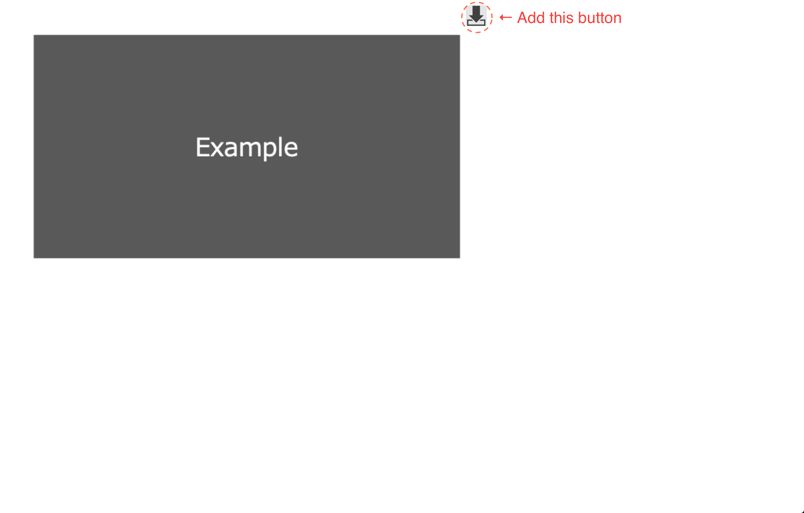

# firefox-addon-quick-download-images

Add a button to save the image quickly by 1-click.

## Motivations

- No Firefox Add-on to save a image with one hand and by 1-click
- Best usability to save images whiling viewing a page for images

## Functions

- If a IMG tag does not have any A-tagged parent node, add a button per such image, and save the image file indicated by `src` property at click
- If a IMG tag has the A-tagged parent node but the `href` property is not any image url, add no button to such images
- If a IMG tag has the A-tagged parent node and the `href` property is an image url, add a button per such image, and save the image file indicated by `href` property at click

## How to use

### Install release version

1. Go to [release page](https://github.com/aazw/firefox-addon-quick-image-save-button/releases/)
1. Select the latest version
1. Click `.xpi` file in Assets section

#### Caution 1

**This add-on is not hosted in official firefox addons page. This github repository is official.**

### Install with debugging mode

1. Run `scripts/build.sh` to build a `firefox-addon.xpi` zip file for Firefox Add-on
1. Input `about:debugging` in the address bar
1. Select `This Firefox` tab
1. Click `Load Temporary Add-on` at `Temporary Extensions` section
1. Select above `firefox-addon.xpi` file

#### Caution 2

**This add-on is not signed by Firfox Add-on Developer Center. So, please install by your own with debugging mode every time you start.**
